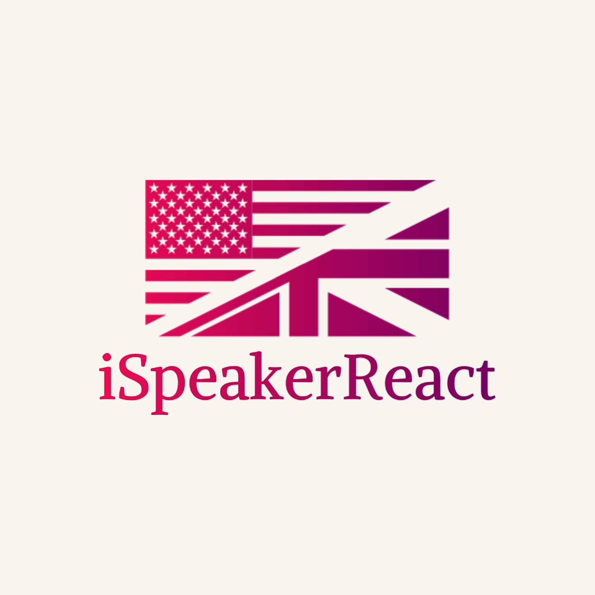
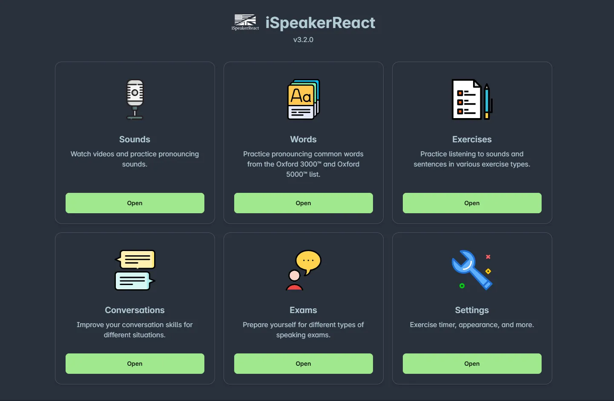

  

# iSpeakerReact

*Formerly Oxford iSpeaker on this repo, a modified version of the official tool of the same name.*

**Introducing iSpeakerReact**: A modern reimagining of Oxford iSpeaker

Rewritten from the ground up with React + Vite, **iSpeakerReact** is a self-study interactive tool designed to help learners improve their speaking and listening skills. Based on the original Oxford iSpeaker developed by Oxford University, this new version blends the best of both worlds.

While the official, modern, Angular-based Oxford iSpeaker has introduced significant updates, it also streamlined or removed certain features that users found valuable (like the Exercises section). Therefore, we’ve decided to rebuild the app based on the older jQuery version, while taking inspiration from the newer Angular version to create a richer, more complete learning experience.

# Use the app

Visit the webiste to use the tool online: <https://yllst-testing-labs.github.io/ispeakerreact/>

Or download the offline portable version: <https://github.com/yllst-testing-labs/ispeakerreact/releases/latest>

For Windows, you can also download from the Microsoft Store if you want automatic updates:

The offline portable version (or "Slim edition" on the Microsoft Store) includes audio files for offline playback. You can manually download the video files in the Settings page for offline use.

**==Also check out other English-learning interactive tools==**

- [iWriter](http://github.com/yell0wsuit/iwriter): help learners write effectively in English.
- [Practical English Usage: Diagnostic Test](http://github.com/yell0wsuit/oxford-peu-diagnostics): help learners improve grammar and vocabulary skills.

## Features

- **Sounds**

  Learning to read phonetic transcriptions in the dictionary is a great way to ensure correct pronunciation. The Sounds section helps you practice pronouncing the International Phonetic Alphabet (IPA) used in English dictionaries. Begin with a video that demonstrates how each sound is pronounced, then use shorter clips to practice. You can also record* your pronunciation for later review and assessment.

- **Exercises**

  Interactive exercises that test how well you can listen and pronounce words. Choose from eight different exercise types:

  - Dictation: Test both your listening and spelling skills.
  - Match-up: Match sounds with the correct written words or phonetic transcriptions.
  - Reordering: Reorder words or sentences to match what you hear.
  - Sounds and Spelling: Listen and choose the correct vowel or diphthong spelling.
  - Sorting: Group words with the same sound, stress, or number of syllables.
  - Odd one out: Identify the word with a different stress pattern, rhythm, or number of syllables.
  - Snap!: Answer "Yes" or "No" to whether the phonetics match the written word or sound the same.
  - Memory match: A timed game where you find pairs of rhyming words or homophones.

- **Conversations**

  Covering over 30 real-life, everyday topics, this section helps you learn how to use appropriate language for various situations. Watch videos to understand different contexts, highlight key phrases, explore additional expressions, and practice by writing and recording* your own conversations.

- **Exams**

  Preparing for an English-speaking exam or a longer speaking task? The Exam section offers a wide range of tasks commonly encountered in evaluations like the Cambridge First, IELTS, TOEFL, and more. Watch real students complete these tasks, highlight key phrases from their responses, and expand your own repertoire of useful expressions. Boost your speaking skills by recording* yourself performing similar tasks, helping you enhance both your language proficiency and exam strategies.

*In order to use the recording functionality, please ensure that you have a microphone device, and you have allowed the app to access it.

## Browser compatibility

Work on the latest version of the following browsers:

- Chromium browsers (Microsoft Edge, Chrome, Opera, Brave, ...)
- Mozilla Firefox
- Safari (macOS, iOS, iPadOS)
