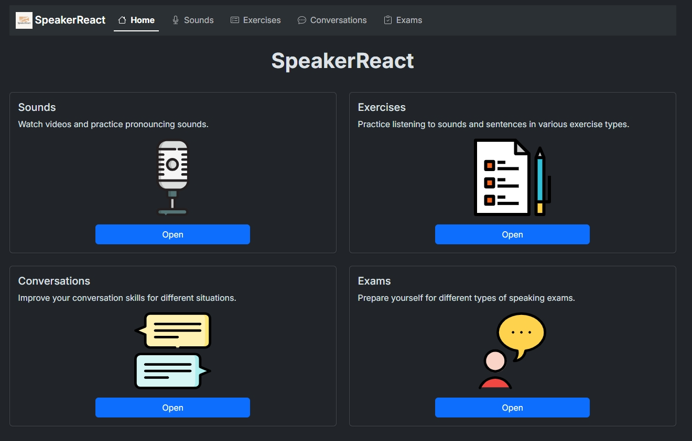

# SpeakerReact

*Formerly Oxford iSpeaker on this repo, a modified version of the official tool of the same name*

**Introducing SpeakerReact**: A modern reimagining of [Oxford iSpeaker](https://www.oxfordlearnersdictionaries.com/about/get-premium/ispeaker)

Rewritten from the ground up, **SpeakerReact** is a self-study interactive tool designed to help learners improve their speaking and listening skills. Based on the original Oxford iSpeaker developed by Oxford University, this new version blends the best of both worlds.

While the official, modern, Angular-based Oxford iSpeaker has introduced significant updates, it also streamlined or removed certain features that users found valuable (like the Exercises section). Therefore, we’ve decided to rebuild the app based on the older jQuery version, while taking inspiration from the newer Angular version to create a richer, more complete learning experience.

Visit the webiste to use the tool online: <https://yell0wsuit.github.io/ispeaker/>

## Now available as an app on Microsoft Store

*The Microsoft Store version will be soon updated to follow the new version, along with name change.*

**==Also check out other English-learning interactive tools==**

- [iWriter](http://github.com/yell0wsuit/iwriter): help learners write effectively in English.
- [Practical English Usage: Diagnostic Test](http://github.com/yell0wsuit/oxford-peu-diagnostics): help learners improve grammar and vocabulary skills.

## Features

- **Pronunciation Made Easy**

  Struggling with English sounds? Dive into the Sounds section of SpeakerReact, encompassing the complete range of English sounds in both British and American English. Engage with instructive videos showcasing accurate pronunciation and sample words from native speakers. Then, practice by listening and recording* yourself.

- **Learn and have fun with Exercises**

  The app offers interactive exercises tailored to your improvement. For example, can you hear the difference between similar-sounding words? Or which words have the primary stress at the beginning? There are 8 types of exercises to choose from.

- **Confidence in Conversations**

  Unlock the art of fluent conversations through SpeakerReact's Conversations segment. Discover a multitude of conversation topics spanning various situations. Watch the sample video conversations, follow the provided script while identifying key language components. Broaden your linguistic horizons by studying and listening to topic-specific phrases. Reinforce your learning via interactive practice activities for a seamless transition to conversational English.

- **Acing Speaking Exams**

  Preparing for an English speaking exam? SpeakerReact's Exam Speaking is here to help. Explore a repertoire of tasks frequently encountered in speaking evaluations like Cambridge First, IELTS, TOEFL, and so on. Watch real students tackle these tasks, pinpoint essential phrases within the scripts, and enhance your comprehension. Tune your ear to both British and American accents while practicing practical language. Elevate your skills by recording* yourself performing similar tasks, refining your language abilities and exam strategies.

*In order to use the recording functionality, please ensure that you have a microphone device,, and you have allowed the app to access it.

## Browser compatibility

Work on the latest version of the following browsers:

- Chromium browsers (Microsoft Edge, Chrome, Opera, Brave, ...)
- Mozilla Firefox
- Safari (macOS, iOS, iPadOS)
